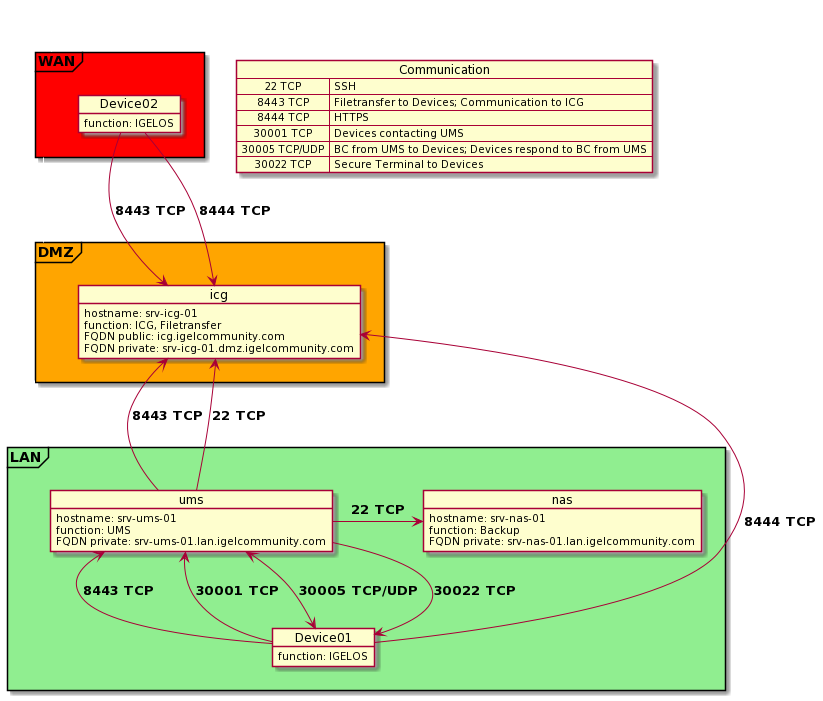

# IGEL-Ansible

## Overview

[**IGEL-Ansible**](https://github.com/IGEL-Community/IGEL-Ansible) provides ansible playbooks and and corresponding files to deploy an IGEL UMS server and an IGEL ICG server on base of Ubuntu (18.04 tested) with the following features:

- UMS server
  - UMS
  - open-ssh with public key
  - Gnome + xRDP to manage the Administrator and UMS console
  - cronjobs
    - rsync to synchronize the default filetransfer path with the one on the ICG server
    - backup files
    - rsync backup to other system

- ICG server
  - ICG
  - open-ssh with public key
  - nginx to provide a file transfer share for Devices via https

Since both UMS and ICG are using interactive installers, a complete automation is not possible. So manual actions are still needed as described below.

## Prerequisites

- 1 linux control node, with ansible 2.5+ and git installed, capable of key based authentication, with internet access
- 2 Ubuntu machines with configured network settings and base user, with internet access
- 1 rsync enabled linux host, capable of key based authentication for backup and restore

## Setup

The configuration provided by the repository refers to the following setup:



## Basic ansible concept

### Inventory

Ansible works against multiple managed nodes or “hosts” in your infrastructure at the same time, using a list or group of lists known as [inventory](https://docs.ansible.com/ansible/latest/user_guide/intro_inventory.html).

### Playbook

[Ansible Playbooks](https://docs.ansible.com/ansible/latest/user_guide/playbooks_intro.html) offer a repeatable, re-usable, simple configuration management and multi-machine deployment system, one that is well suited to deploying complex applications.

### Role

[Roles](https://docs.ansible.com/ansible/latest/user_guide/playbooks_reuse_roles.html) let you automatically load related vars_files, tasks, handlers, and other Ansible artifacts based on a known file structure.

## Quickstart

### Install ansible

Install ansible on a control node: [Installing Ansible](https://docs.ansible.com/ansible/latest/installation_guide/intro_installation.html)

### Clone the repo

Use your favorite Git client (e.g. git, Github Desktop etc.) to clone the IGEL-Ansible repository via HTTPS

via git:

```bash
git clone https://github.com/IGEL-Community/IGEL-Ansible.git
```

### Install required roles from ansible galaxy

The playbooks use additional roles from the ansible playbook:

```bash
cd IGEL-Ansible
ansible-galaxy install -r roles/requirements.yml -p ./roles/ --force
```

### Configure settings

Adjust settings in the following files to reflect your needs.

- `inventories/IGEL/hosts.yml`
  - hosts (name of the managed node)
  - ansible_host (IP address or FQDN)

- `inventories/IGEL/group_vars/all.yml`
  - variables for all managed nodes in the inventory

- `inventories/IGEL/host_vars/srv-icg-01.yml`
  - variables for the managed node with the name **srv-icg-01.yml**
  - rename that file to reflect the name of the actual ICG server from `inventories/IGEL/hosts.yml`

- `inventories/IGEL/host_vars/srv-ums-01.yml`
  - variables for the managed node with the name **srv-ums-01.yml**
  - rename that file to reflect the name of the actual UMS server from `inventories/IGEL/hosts.yml`
  
#### Secrets

To store secrets encrypted in our inventories and/or playbooks (that may end up in a repository) we create and use a password file (which does not belong in a repository):

```bash
echo "SecretPassword" > ~/.vault_pass.txt
```

The content of that file is not encrypted and can be read by anyone with access to it. Therefore store it in your home path.

To encrypt a secret for use `ansible-vault encrypt`.

##### Examples

Encrypt the string "test" as variable "test":

```bash
ansible-vault encrypt_string "12345" --name test --vault-pass ~/.vault_pass.txt
test: !vault |
          $ANSIBLE_VAULT;1.1;AES256
          38333732326436363337376132313837393731626536343735353933643965376432626135343239
          3635363564303562646264656430383930353534636233390a396562326535363234626138346266
          61383636666133333966643431646332363436613461316338393961393631346461333832396230
          6133393938343334620a663435633064653861613862383733623563336630623161353563336365
          6264
Encryption successful
```

Encrypt the content of the file test.txt as variable "test":

```bash
ansible-vault encrypt_string test.txt --name test --vault-pass ~/.vault_pass.txt
test: !vault |
          $ANSIBLE_VAULT;1.1;AES256
          32336666663134643761633965393232626133643262396463383338346537346134343939396438
          3235333232326339313736333835653163393033366430360a303765313165363934326539663333
          37353963383236386332613262623364343037356565663463616562366661303834643034613861
          6532323932646637330a323266666137613430626165386234313939633665643164633039616635
          3665
Encryption successful
```

Encrypt the file test.txt:

```bash
ansible-vault encrypt test.txt --vault-pass ~/.vault_pass.txt
Encryption successful
cat test.txt
$ANSIBLE_VAULT;1.1;AES256
35386130653163613035306538383065623238376163323266346638646365393865306437356537
3537653035396466366232633866336632613763336130310a376462386365373136626437393736
66376436386137373135646133306433396636626666333537623139663065663431393766353963
3764313137303637310a393433663664303535306539636137336561353466366264333063623462
3035
```

### Run the UMS playbook

execute UMS playbook:

```bash
ansible-playbook configure_igel_ums.yml -i inventories/ICG/hosts.yml --vault-password-file ~/.vault_pass.txt
```

### Configure the UMS

- Connect to the gnome Desktop (via RDP)
- Open a terminal

```bash
cd ~
./setup.bin
```

- Follow install routine
- Optional: Open the UMS Administrator -> Backup -> Restore latest backup (optional)
- UMS Console -> Global Configuration -> Certificate Management -> Cloud Gateway -> Export certificate chain to IGEL Cloud Gateway keystore format
- copy keystore.icg to /opt/IGELRM..../ums_filetransfer

```bash
# execute sync filetransfer
```

### Run the ICG playbook

execute ICG playbook:

```bash
ansible-playbook configure_igel_icg.yml -i inventories/ICG/hosts.yml --vault-password-file ~/.vault_pass.txt
```

- Connect to the host per ssh with configured user account

```bash
cd ~
sudo -s
./installer*.bin /ums_filetranser/keystore.icg
```

- Follow install routine
- UMS Console -> UMS Administration -> IGEL Cloud Gateway -> Add existing Gateway to database
